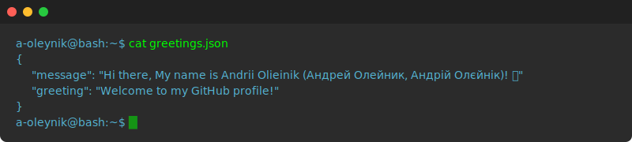

I'm a Senior Software Engineer in Test and QAA Architect based in Wrocław, Poland, with over 16 years of experience primarily in test automation. I specialize in developing and supporting automation frameworks and infrastructure for API, UI (Web/Desktop/Mobile), database, JMS, and performance testing. I have a proven track record in optimizing test frameworks, managing CI/CD pipelines for autotests, and leading QA teams.

I’m passionate about Machine Learning and Deep Learning. My academic background includes a PhD in theoretical physics, specializing in the physics of water, from the Department of Theoretical Physics at ONU named after I.I. Mechnikov.

### 🛠️ Skills and Technologies

  
   

### 📖 Scientific papers
- [Andrii V. Olieinik, abstract of a Ph.D. thesis: Nature of thermodynamic and kinetic properties of water on the liquid-vapour coexistence line \[In Ukrainian\]](http://theorphys.onu.edu.ua/uploads/sharedfiles/data/thesises/olieinik_a_2013_abstract.pdf)
- [Andrii V. Olieinik, Ph.D. thesis: Nature of thermodynamic and kinetic properties of water on the liquid-vapour coexistence line \[In Russian\]](http://theorphys.onu.edu.ua/uploads/sharedfiles/data/thesises/olieinik_a_2013.pdf)
- [Bardyk V.Yu., Olieinik A.V. Anomalous temperature dependence of water specific volume near the melting point. \[In Ukrainian\] // Bulletin of Taras Shevchenko National University of Kyiv. Series Physics & Mathematics. – 2012, №4 . – P. 267 – 272. ](https://bphm.knu.ua/index.php/bphm/issue/view/34/2012_4)
- [Malomuzh N.P., Oleinik A.V. Pankratov K.M. The nature of molecular self-diffusion in argon and water. // UJP. – 2010. – 55, N10, – P. 1123 – 1127.](http://archive.ujp.bitp.kiev.ua/files/journals/55/10/551009p.pdf)
- [Malomuzh N.P., Oleinik A.V. Nature of the kinematic shear viscosity of water. // J. Struct. Chem. – 2008. – 49, N6, – P. 1055 – 1063.](http://dx.doi.org/10.1007/s10947-008-0178-1)
- [Fisenko A.I., Malomuzh N.P., Oleynik A.V. To what extent are thermodynamic properties of water argon-like? // CPL. – 2008. – 450, – P. 297–301.](http://dx.doi.org/10.1016/j.cplett.2007.11.036)
- [Malomuzh N.P., Oleynik A.V., Rudenko A.P., Khlopov A.M. Nature of the kinematic shear viscosity of benzene and its derivatives. // UJP. – 2007. – 52, N10, – P. 393 – 945.](http://archive.ujp.bitp.kiev.ua/files/journals/52/10/521003p.pdf)

### 📬 Get in Touch

- Connect with me on [Linkedin](https://www.linkedin.com/in/andrii-olieinik/)
- My presentations [Slideshare](https://www.slideshare.net/oleynikandrey)
- Read more of my articles on [Medium](https://medium.com/@andrei.oleynik)
- Read my reviews of some books [Goodreads](https://www.goodreads.com/user/show/87411224-andrey-oleynik)
- My profile on [Leetcode](https://leetcode.com/u/andreioleynik/)
- My profile on [Coursera](https://www.coursera.org/learner/andrii-olieinik)
- My profile on [Stackoverflow](https://stackoverflow.com/users/1701001/andrii-olieinik)

### 📊 GitHub Stats

    

        
    

    

        
    

<!--
**a-oleynik/a-oleynik** is a ✨ _special_ ✨ repository because its `README.md` (this file) appears on your GitHub profile.

Here are some ideas to get you started:

- 🔭 I’m currently working on ...
- 🌱 I’m currently learning ...
- 👯 I’m looking to collaborate on ...
- 🤔 I’m looking for help with ...
- 💬 Ask me about ...
- 📫 How to reach me: ...
- 😄 Pronouns: ...
- ⚡ Fun fact: ...
-->
