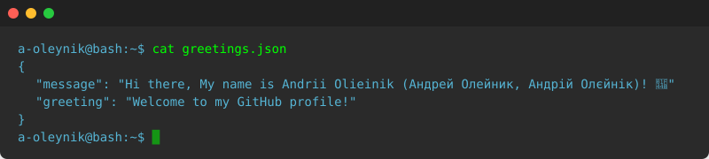

I'm a QA Automation Architect and Senior SDET with 18+ years of experience
building automation frameworks and testing infrastructure for web, mobile,
desktop, APIs, messaging systems, databases, and performance testing.

I design maintainable test solutions, CI/CD pipelines, and developer tooling
using Java, Python, JavaScript/TypeScript, Kotlin, and C#. My current interests
include JUnit 6, Playwright, developer productivity, and applications of AI
in software testing.

I hold a PhD in theoretical physics from Odessa I. I. Mechnikov National
University, where my research focused on the physics of water and liquids.

### 🛠️ Skills and Technologies

#### Languages

#### Test automation and reporting

#### Performance and cloud testing

#### Engineering tooling

**Additional experience:** Selenide, Shell, GitLab CI, PostgreSQL, MySQL/MariaDB, Oracle Database, Microsoft SQL Server, JMS, AWS, and Microsoft Azure.

**Testing domains:** Web, mobile, desktop, API, database, messaging, and performance.

### ✍️ Medium Articles

#### English (@andrei.oleynik)
- [Forget WebDriverManager: Use Selenium Manager Instead](https://medium.com/javarevisited/forget-webdrivermanager-use-selenium-manager-instead-1acf7e1076f3)
- [Serenity BDD in 2026: A Framework or Dependency Hell](https://medium.com/@andrei.oleynik/serenity-bdd-in-2026-a-framework-or-dependency-hell-015e3d16d33e)
- [TestNG XML Is a Legacy Concept: Here's What Modern Test Suites Should Look Like](https://medium.com/javarevisited/testng-xml-is-a-legacy-concept-heres-what-modern-test-suites-should-look-like-bd5cb380db61)
- [WebDriver getAttribute() is Back: When to Use It vs getDomAttribute() and getDomProperty()](https://medium.com/javarevisited/adventures-of-getattribute-back-from-the-dead-846c31f5bcab)
- [JUnit 6 Released — Clean-Up, Modernization & Minimal Disruption](https://medium.com/@andrei.oleynik/junit-6-released-clean-up-modernization-minimal-disruption-d3ecf11b64ad)
- [Mastering Live Coding: Two Problems, Practical Insights (Part 1)](https://medium.com/@andrei.oleynik/mastering-live-coding-two-problems-practical-insights-part-1-015f3dd7e80c)
- [Boris Bondarenko's Piramida: A Novel of Particle Physics, Discipline, and Scientific Calling](https://medium.com/@andrei.oleynik/review-of-boris-bondarenkos-novella-the-pyramid-77f7440430c6)
- [Review of Ève Curie's Biography Madame Curie](https://medium.com/@andrei.oleynik/review-of-eve-curies-biography-madame-curie-b538a31d3ace)
- [Exploring the Fourth Dimension: Reflections on The Time Machine and Its Legacy](https://medium.com/@andrei.oleynik/exploring-the-fourth-dimension-reflections-on-the-time-machine-and-its-legacy-01-092ae18fa302)

#### Ukrainian/Russian (@aolieinik)
- [Установка и настройка Java-окружения на Windows, macOS и Ubuntu: JDK, Maven и Gradle](https://medium.com/@aolieinik/java-installation-and-set-up-on-windows-mac-and-ubuntu-jdk-maven-gradle-r-ee8afd8c97de)
- [Забудьте про WebDriverManager: Selenium уже делает это за вас](https://medium.com/@aolieinik/forget-webdrivermanager-use-selenium-manager-5491b1a21789)
- [Serenity BDD в 2026: мощный фреймворк или свалка зависимостей?](https://medium.com/@aolieinik/serenity-bdd-a-framework-or-a-garbage-dumb-of-dependencies-r-c187b45c10a7)
- [Папирусы древних тестировщиков: почему testng.xml больше не нужен](https://medium.com/@aolieinik/testng-xml-is-a-legacy-concept-heres-what-modern-test-suites-should-look-like-r-cbde2581c5e8)
- [WebDriver getAttribute() повернувся: коли використовувати його vs getDomAttribute() і getDomProperty()](https://medium.com/@aolieinik/adventures-of-getattribute-back-from-the-dead-ukr-dc796e341e76)
- [Пирамида — повесть о физике элементарных частиц в СССР](https://medium.com/@aolieinik/review-of-boris-bondarenkos-novella-the-pyramid-r-ea187e7f8b80)
- [Рецензия на книгу Евы Кюри «Мария Кюри»](https://medium.com/@aolieinik/review-of-madame-curie-book-by-eva-curie-r-9f354dbaa553)

### 📖 Scientific papers

- [Andrii V. Olieinik, abstract of a Ph.D. thesis: Nature of thermodynamic and kinetic properties of water on the liquid-vapour coexistence line \[In Ukrainian\]](papers/olieinik_a_2013_abstract.pdf)
- [Andrii V. Olieinik, abstract of a Ph.D. thesis: Nature of thermodynamic and kinetic properties of water on the liquid-vapour coexistence line \[In Russian\]](papers/olieinik_a_2013_abstract_rus.pdf)
- [Andrii V. Olieinik, Ph.D. thesis: Nature of thermodynamic and kinetic properties of water on the liquid-vapour coexistence line \[In Russian\]](papers/olieinik_a_2013.pdf)
- [Andrii V. Olieinik, Ph.D. thesis defense presentation \[In Ukrainian\]](papers/olieinik_a_2013_thesis_presentation.pdf)
- [Bardyk V.Yu., Olieinik A.V. Anomalous temperature dependence of water specific volume near the melting point. \[In Ukrainian\] // Bulletin of Taras Shevchenko National University of Kyiv. Series Physics & Mathematics. – 2012, №4 . – P. 267 – 272. ](https://bphm.knu.ua/index.php/bphm/issue/view/34/2012_4)
- [Malomuzh N.P., Oleinik A.V. Pankratov K.M. The nature of molecular self-diffusion in argon and water. // UJP. – 2010. – 55, N10, – P. 1123 – 1127.](http://archive.ujp.bitp.kiev.ua/files/journals/55/10/551009p.pdf)
- [Malomuzh N.P., Oleinik A.V. Nature of the kinematic shear viscosity of water. // J. Struct. Chem. – 2008. – 49, N6, – P. 1055 – 1063.](http://dx.doi.org/10.1007/s10947-008-0178-1)
- [Fisenko A.I., Malomuzh N.P., Oleynik A.V. To what extent are thermodynamic properties of water argon-like? // CPL. – 2008. – 450, – P. 297–301.](http://dx.doi.org/10.1016/j.cplett.2007.11.036)
- [Malomuzh N.P., Oleynik A.V., Rudenko A.P., Khlopov A.M. Nature of the kinematic shear viscosity of benzene and its derivatives. // UJP. – 2007. – 52, N10, – P. 393 – 945.](http://archive.ujp.bitp.kiev.ua/files/journals/52/10/521003p.pdf)

### 📬 Get in Touch

- Connect with me on [Linkedin](https://www.linkedin.com/in/andrii-olieinik/)
- My presentations [Slideshare](https://www.slideshare.net/oleynikandrey)
- Read my English-language articles on [Medium (@andrei.oleynik)](https://medium.com/@andrei.oleynik)
- Read my Ukrainian- and Russian-language articles on [Medium (@aolieinik)](https://medium.com/@aolieinik)
- Read my reviews of some books [Goodreads](https://www.goodreads.com/user/show/87411224-andrey-oleynik)
- My profile on [Leetcode](https://leetcode.com/u/andreioleynik/)
- My profile on [Coursera](https://www.coursera.org/learner/andrii-olieinik)
- My profile on [Stackoverflow](https://stackoverflow.com/users/1701001/andrii-olieinik)

### 📊 GitHub Stats

    
    

    

